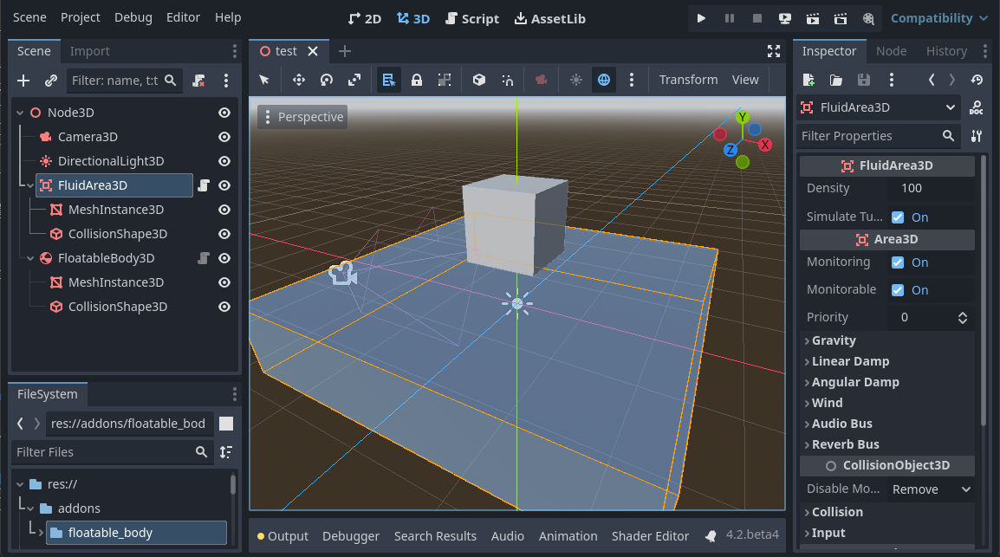
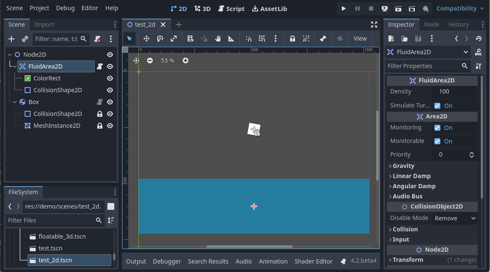

[日本語](README_ja.md)

# FloatableBody

## Description

This is a simple physics system working on Godot Engine 4 that simulates the behavior of an object floating in a water-like fluid.

- All buoyancy control code is written in GDScript.
- Physics process are simplified, so it works well on mobile and web.
- You can use either 3D or 2D.

## Basic usage
Create a scene with a `FluidArea3D` node to represent underwater and a `FloatableBody3D` node to represent a floating object.

1. Add a `FluidArea3D` node to the scene. This node inherits from `Area3D`, so add a `CollisionShape3D` to it as a child node and set the shape. I recommend adding a `MeshInstance3D` to make it visually compelling.
2. Add a `FloatableBody3D` node to the scene. This node inherits from `RigidBody3D`, so add a `CollisionShape3D` as a child node to it and set the shape.
3. Play the scene. The `FloatableBody3D` will fall down and enter the `FluidArea3D` and will be raised by buoyancy.

The above explanation is for 3D, but the procedure is the same for 2D.

## Specification of parameters
Describes the parameters that are important for an `FloatableBody3D/2D` to float in water.
- `Density` of `FluidArea3D/2D`.
  - The more fluid density you increase, the more buoyant the object will be.
- `Mass` of `RigidBody3D/2D`.
  - The more you increase the object's mass, the less buoyant it will be.
- `Center of Mass` of `RigidBody3D/2D`
  - The center of gravity of an object affects its stability. A ship, for example, will move more naturally if its center of mass is lowered.
- Volume (`Size`, `Radius`, `Height`) of `Shape3D/2D` of `CollisionShape3D/2D`
  - The more you increase the volume of an object, the more buoyant it will be. Larger objects should be balanced by increasing their mass.
- `Fluid Damp` of `FloatableBody3D/2D`.
  - The more resistance you increase, the harder it will be for the object to move in the fluid. If the resistance is too small, the object will move unnaturally, so increase the resistance to stabilize the object.

## Advanced usage
For cases where you want to use buoyancy with `CharacterBody3D/2D`, use `FluidInteractor3D/2D`. This is the class used inside `FloatableBody3D/2D`.

There is `FloatablePlayer3D/2D` as a sample code. Please refer there for detailed usage.

- [floatable_player_3d.gd](addons/floatable_body/floatable_player_3d.gd)
- [floatable_player_2d.gd](addons/floatable_body/floatable_player_2d.gd)

## Using Assets (Demo)
- Sail Ship by Quaternius (https://poly.pizza/m/cIzO4MBPqI)
- Rubber Duck by CreativeTrio (https://poly.pizza/m/oH3dEdlDpB)
- Crate by Quaternius (https://poly.pizza/m/SfJtdV8GDr)
- Coin by Quaternius (https://poly.pizza/m/7IrL01B97W)
- "Water drop (splash)" by bolkmar is marked with CC0 1.0.
- "POOL SPLASH 3" by tbsounddesigns is marked with CC0 1.0.
- "Plingy Coin" by Fupicat is marked with CC0 1.0.
- "Goose And Duck" by ChunaawChika09 is marked with CC0 1.0.
